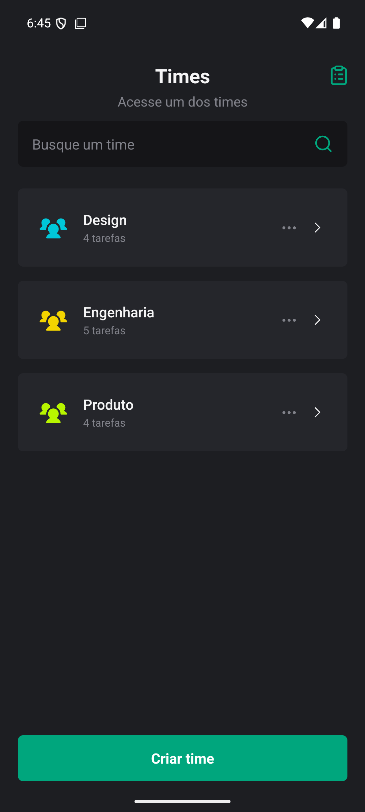
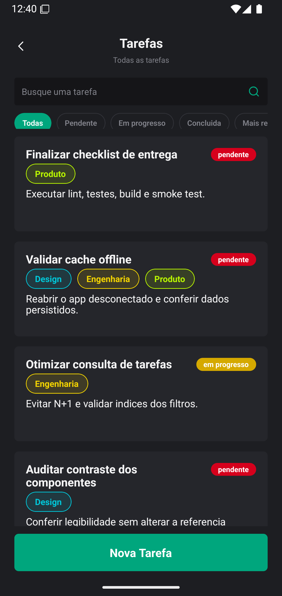
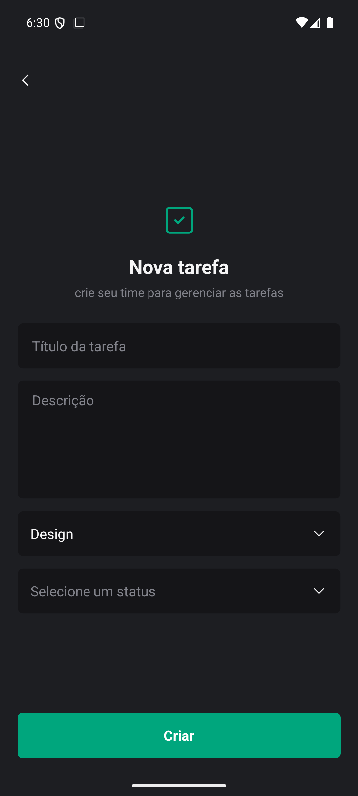
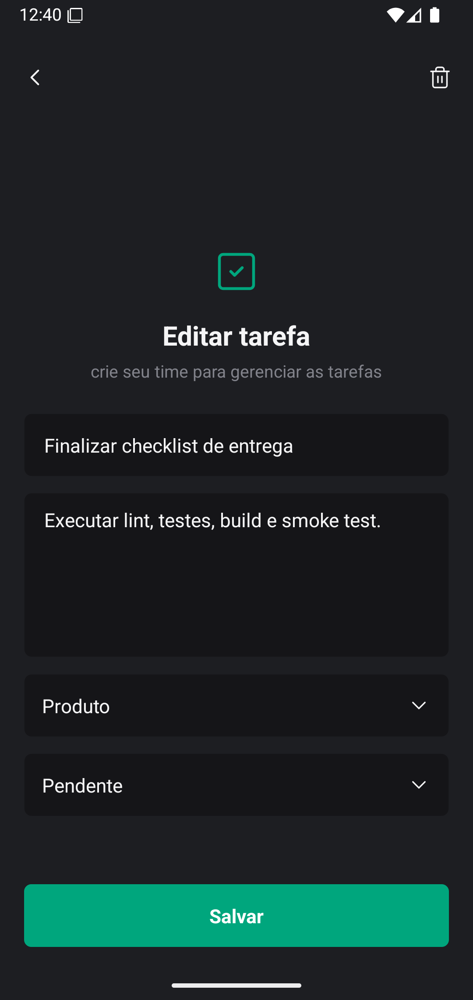
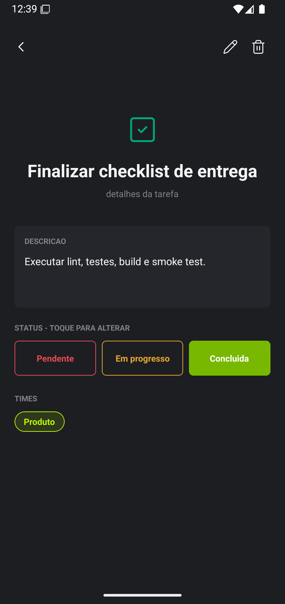
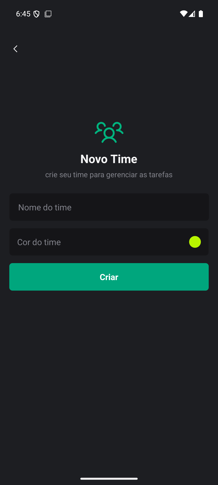
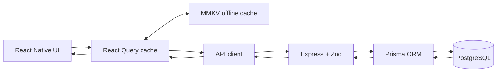
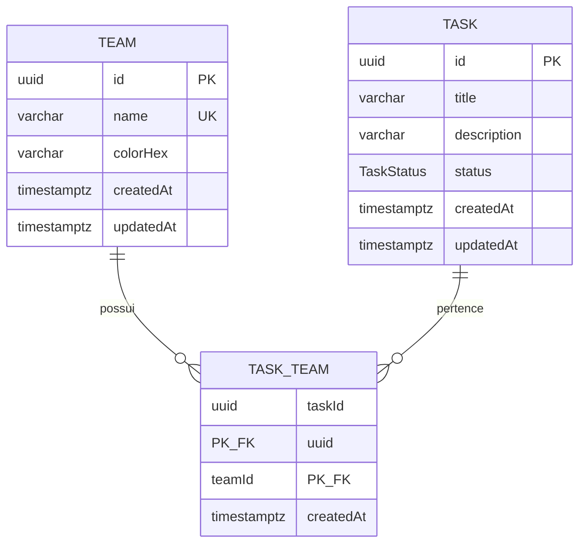

# Times e Tarefas - React Native + Express + PostgreSQL

Aplicacao fullstack para gerenciar times e tarefas. Mobile React Native CLI consome API Express real; API persiste dados em PostgreSQL via Prisma. Inclui CRUDs, relacionamento N:N, busca, filtros combinados, ordenacao, paginacao, cache offline, optimistic update, migrations, seed, Swagger, testes e automacao Windows.



| Tarefas filtradas | Formulario de tarefa |
| --- | --- |
|  |  |

### Editar tarefa



### Detalhe da tarefa



### Novo Time



## Funcionalidades

- Times: listar, pesquisar, paginar, detalhar, criar, editar e excluir com confirmacao.
- Tarefas: criacao, lista global ou por time, detalhe, edicao completa,
  exclusao, pesquisa textual, ordenacao e paginacao.
- Tarefas podem pertencer a zero, um ou varios times.
- Exclusao de time remove somente vinculos; tarefas permanecem.
- Status `PENDING`, `IN_PROGRESS` e `COMPLETED`, com alteracao rapida no detalhe.
- Times aparecem como chips coloridos nos cards e no detalhe da tarefa.
- Loading, refresh, pagina seguinte, vazio, sem resultados, erro/retry e feedback de mutacao.
- Cache de queries em MMKV por sete dias; ultimos dados ficam visiveis offline.
- Reconexao refaz queries. Mutacoes offline nao fingem sucesso e nao sao enfileiradas.
- Alteracao de status e otimista, com rollback se API falhar.
- Swagger em `/docs` e contrato OpenAPI em `/openapi.json`.

## Stack validada

| Camada | Tecnologias |
| --- | --- |
| Mobile | React Native CLI 0.86, React 19, TypeScript 5.8, React Navigation 7 |
| Estado remoto | TanStack React Query 5 + persistencia MMKV 4 + NetInfo |
| Formularios | React Hook Form 7 + Zod 4 (`zod/v3` no bundle RN por compatibilidade Metro) |
| UI | NativeWind 4, Tailwind CSS 3, Lucide, React Native SVG, Safe Area |
| API | Node.js 24 LTS, Express 5, TypeScript 6, Zod 4 |
| Dados | PostgreSQL 18, Prisma 6.19, migrations SQL versionadas |
| Testes | Vitest, Supertest, Jest, React Native Testing Library |
| Ambiente usado | Windows 11, JDK 17, Android API 36, AVD `RN_Android_API_36` |

## Arquitetura

```text
RN/
├── api/
│   ├── prisma/                 schema, migrations e seed
│   ├── src/
│   │   ├── config|db|errors|middleware|validation/
│   │   ├── routes/             health, teams e tasks
│   │   └── openapi.ts
│   └── tests/                  unitarios e integracao PostgreSQL
├── mobile/
│   ├── android|ios/
│   └── src/
│       ├── app|navigation|storage/
│       ├── design-system/
│       ├── features/teams|tasks/
│       ├── screens|services|types|hooks/
├── docs/                       especificacao visual e screenshots
├── scripts/                    automacao PowerShell/Windows
├── docker-compose.yml
└── package.json                comandos de conveniencia
```



### Decisoes

- PostgreSQL: integridade referencial, transacoes, N:N, filtros e ordenacao SQL. Trade-off: exige processo externo e migrations.
- Prisma: schema tipado, migration reproduzivel e includes que evitam N+1. Trade-off: engine e etapa de geracao.
- Express: pequeno, explicito e adequado ao escopo. Validacao e erros ficam fora de componentes mobile.
- React Query: API e cache sao unica fonte de server state. Estado de busca/filtro continua local.
- MMKV: cache sincrono e rapido no Android. MMKV 4 exige New Architecture/Nitro, habilitada no projeto.
- Sem Redux/Zustand: nenhum estado global adicional e necessario.
- Sem fila offline de mutacao: evita duplicacao e conflitos silenciosos. Usuario recebe erro real; queries sao refeitas na reconexao.

## Modelo de dados



`TaskTeam` usa chave composta e indices nos dois sentidos. FKs usam `ON DELETE CASCADE` somente no vinculo: excluir time nao exclui tarefa; excluir tarefa nao exclui time.

## Pre-requisitos Windows

- Windows 10/11 com PowerShell 7 ou Windows PowerShell 5.1.
- Node.js 24 LTS e npm 11.
- Docker Desktop para fluxo recomendado, ou PostgreSQL 18 local.
- JDK 17.
- Android Studio/SDK, Platform 36, Build Tools 36 e AVD.
- `ANDROID_HOME` configurado; `adb` e `emulator` no `PATH`.

Validado neste workspace com Node `24.18.0`, npm `11.16.0`, OpenJDK `17.0.20`, PostgreSQL `18.4` nativo e AVD API 36. Docker nao estava instalado no host de validacao; Compose foi fornecido para reproducao limpa.

No Windows, prefira um caminho curto, como `C:\dev\times-tarefas-fullstack`.
Dependencias nativas do React Native/CMake podem exceder o limite de caminho do
Windows quando o repositorio fica aninhado em diretorios longos.

## Variaveis de ambiente

Copie exemplos; nunca versione os arquivos gerados:

```powershell
Copy-Item .env.example .env
Copy-Item api\.env.example api\.env
Copy-Item mobile\.env.example mobile\.env
```

| Arquivo/variavel | Finalidade | Exemplo seguro | Obrigatoria |
| --- | --- | --- | --- |
| raiz `POSTGRES_DB` | banco do Compose | `rn_app` | nao, possui default |
| raiz `POSTGRES_USER` | usuario Compose | `rn_app_user` | nao, possui default |
| raiz `POSTGRES_PASSWORD` | senha local Compose | `rn_app_password` | nao, possui default |
| raiz `POSTGRES_PORT` | porta host | `5433` | nao |
| API `NODE_ENV` | ambiente | `development` | nao |
| API `HOST`/`PORT` | bind HTTP | `0.0.0.0` / `3000` | nao |
| API `PGHOST`/`PGPORT` | PostgreSQL | `127.0.0.1` / `5433` com Compose | nao |
| API `PGDATABASE` | database | `rn_app` | sim |
| API `PGUSER` | usuario | `rn_app_user` | sim |
| API `PGPASSWORD` | senha | `rn_app_password` | sim |
| API `PGPOOL_MAX` | limite do pool | `10` | nao |
| API `CORS_ORIGIN` | origem permitida | `*` somente local | nao |
| Mobile `API_BASE_URL` | host da API | `http://localhost:3000` | nao, possui default local |

Prisma recebe URL montada internamente a partir de `PG*`; senha nao precisa ser duplicada em `DATABASE_URL`.

## Execucao local

### 1. Instalacao limpa

Na raiz `C:\RN`:

```powershell
npm ci
```

`postinstall` executa `npm ci` em `api/` e `mobile/`, usa ambos os lockfiles e gera Prisma Client explicitamente.

### 2. PostgreSQL

Com Docker Desktop, use `PGPORT=5433` no `api\.env`:

```powershell
npm run db:up
docker compose ps
```

Sem Docker, crie banco/usuario equivalentes no PostgreSQL local e ajuste `api\.env`. Teste com `pg_isready -h 127.0.0.1 -p 5432`.

### 3. Migration e seed

```powershell
npm run db:migrate
npm run db:seed
```

Migration leva banco vazio ao schema completo. Seed e idempotente.

### 4. API

Desenvolvimento, em um terminal:

```powershell
npm run dev --prefix api
```

Ou build/start:

```powershell
npm run build --prefix api
npm run start --prefix api
```

Verifique:

```powershell
curl.exe http://localhost:3000/health
curl.exe http://localhost:3000/health/db
Start-Process http://localhost:3000/docs
```

### 5. Android Emulator

Inicie um AVD pelo Device Manager do Android Studio. Em outro PowerShell:

```powershell
cd C:\RN
npm run android
```

`npm run android` inicia Metro quando necessario, compila/instala o app e
configura `adb reverse` para API e Metro. Sem reverse, use
`http://10.0.2.2:3000` no `mobile\.env` e recompile. Dispositivo fisico via
Wi-Fi deve usar IP privado do computador; producao deve usar HTTPS.

Alternativa: `npm run dev` inicia API e Metro juntos; mantenha esse terminal
aberto e execute `npm run android` em outro.

## Scripts

| Comando na raiz | Acao |
| --- | --- |
| `npm ci` | instala raiz e ambos os projetos |
| `npm run dev` | inicia API, aguarda healthcheck e mantem Metro no terminal atual |
| `npm start` | inicia API compilada |
| `npm run lint` | ESLint API + mobile |
| `npm run format` | Prettier API + mobile |
| `npm run format:check` | valida formatacao |
| `npm run typecheck` | TypeScript estrito em ambos |
| `npm test` | testes API + mobile |
| `npm run test:unit` | unitarios API |
| `npm run test:integration` | integracao API/PostgreSQL |
| `npm run test:mobile` | Jest/RNTL |
| `npm run build` | compila API + APK debug |
| `npm run db:up` / `db:down` | sobe/desliga PostgreSQL Compose |
| `npm run db:migrate` | `prisma migrate deploy` |
| `npm run db:seed` ou `npm run seed` | seed idempotente |
| `npm run android` | build, instala e abre app |
| `npm run validate` | lint, typecheck, testes, build API e APK debug |

## Contratos da API

Todas as listagens retornam `{ data, meta }`, com `total`, `limit`, `offset`, `hasNext`. Recursos unitarios retornam `{ data }`. Erros usam:

```json
{
  "error": {
    "code": "VALIDATION_ERROR",
    "message": "Os dados enviados sao invalidos.",
    "details": [{ "path": "title", "message": "..." }]
  }
}
```

### Times

- `GET /api/teams?limit=&offset=&search=`
- `GET /api/teams/:id`
- `POST /api/teams`
- `PUT /api/teams/:id`
- `DELETE /api/teams/:id`

### Tarefas

- `GET /api/tasks?teamId=&status=&search=&limit=&offset=&sort=`
- `GET /api/tasks/:id`
- `POST /api/tasks`
- `PUT /api/tasks/:id`
- `PATCH /api/tasks/:id/status`
- `DELETE /api/tasks/:id`

Sort permitido: `createdAt:desc`, `createdAt:asc`, `updatedAt:desc`, `title:asc`, `title:desc`. Limite maximo: 100. Entrada invalida usa HTTP 422; conflito 409; ausente 404; exclusao 204.

## cURLs copiaveis

```powershell
# Criar time
curl.exe -X POST http://localhost:3000/api/teams `
  -H "Content-Type: application/json" `
  -d '{"name":"Operacoes","colorHex":"#6750A4"}'

# Pesquisar/paginar times
curl.exe "http://localhost:3000/api/teams?search=opera&limit=10&offset=0"

# Criar tarefa sem time
curl.exe -X POST http://localhost:3000/api/tasks `
  -H "Content-Type: application/json" `
  -d '{"title":"Revisar deploy","description":null,"status":"PENDING","teamIds":[]}'

# Criar tarefa com dois times (substitua UUIDs)
curl.exe -X POST http://localhost:3000/api/tasks `
  -H "Content-Type: application/json" `
  -d '{"title":"Revisar fluxo","status":"IN_PROGRESS","teamIds":["11111111-1111-4111-8111-111111111111","22222222-2222-4222-8222-222222222222"]}'

# Filtros combinados
curl.exe "http://localhost:3000/api/tasks?teamId=11111111-1111-4111-8111-111111111111&status=PENDING&search=revisar&sort=updatedAt:desc&limit=20&offset=0"

# Alterar status
curl.exe -X PATCH http://localhost:3000/api/tasks/UUID/status `
  -H "Content-Type: application/json" -d '{"status":"COMPLETED"}'

# Atualizar e excluir
curl.exe -X PUT http://localhost:3000/api/teams/UUID `
  -H "Content-Type: application/json" `
  -d '{"name":"Operacoes Editado","colorHex":"#6750A4"}'
curl.exe -X DELETE http://localhost:3000/api/tasks/UUID
```

## Seed

`npm run db:seed` faz upsert de 3 times e 10 tarefas fixas, cobre tres status, tarefa sem time, tarefas com varios times e descricoes de tarefa pesquisaveis. Depois redefine somente vinculos das tarefas do seed, portanto repeticao nao duplica dados.

## Testes e qualidade

```powershell
npm run lint
npm run typecheck
npm run test:unit
npm run test:integration
npm run test:mobile
npm run build
```

- API unit: ambiente, payloads, cores, titulo, status, filtros, paginacao, sort e envelopes.
- API integracao: PostgreSQL real, CRUD completo, conflitos, zero/multiplos times, pesquisa, filtros combinados, metadata, status, update, exclusoes e preservacao de tarefa.
- Mobile: listas, detalhe, edicao completa, chips coloridos, acoes de status,
  API client, formularios e transformacao de cache otimista.
- CI em `.github/workflows/ci.yml` sobe PostgreSQL e executa migration, seed,
  lint, typecheck, testes e build da API.

## Referencia visual

Fonte: unico print anexado ao Goal, prancha 751 x 935 com cinco mockups. Analise detalhada: [`docs/visual-spec.md`](docs/visual-spec.md).

| Regiao do print | Implementacao |
| --- | --- |
| Lista `Times`, busca, cards coloridos, CTA | `TeamsScreen`, `TeamCard`, `SearchInput` |
| Lista `Tarefas`, cards e pills | `TasksScreen`, `TaskCard`; filtros somente na lista global |
| Detalhe, chips e status rapido | `TaskDetailScreen`, `TaskTeamChips` |
| `Novo Time` | `TeamFormScreen` com RHF/Zod e paleta |
| `Nova tarefa` | `TaskFormScreen`, seletores modais de status e multi-times |
| `Editar tarefa` + lixeira | `TaskFormScreen` com edicao completa via `PUT` |

Tokens aproximados inferidos: canvas `#1D1E22`, surface `#25262B`, input `#151518`, primary `#00A67D`, texto `#F5F5F6`, muted `#81828A`, raios 3-6 dp e padding principal 20 dp. Valores sao aproximacoes visuais, nao medidas declaradas pelo design.

Telas extras obrigatorias (detalhe, filtros, loading, vazio, erro, offline e
confirmacoes) derivam dos mesmos tokens. Icones Lucide substituem os desenhos
lineares do print sem emojis. Chips de time usam `colorHex`, como exige o
brief. Busca, filtros e ordenacao continuam acessiveis na lista global; a
lista aberta por um time segue a composicao limpa da referencia.

## Deploy

Nenhum deploy externo foi executado: nao houve autorizacao nem credenciais. API esta preparada com `api/Dockerfile`, variaveis, healthcheck e migration deploy.

```powershell
docker build -t times-tarefas-api api
docker run --rm --env-file api\.env times-tarefas-api node dist/db/runPrisma.js migrate deploy
docker run --rm -p 3000:3000 --env-file api\.env times-tarefas-api
curl.exe http://localhost:3000/health
```

Em plataforma gerenciada: provisionar PostgreSQL, definir `PG*`, executar migration como release command, iniciar `node dist/server.js` e configurar healthcheck `/health`.

## Producao

Evolucoes recomendadas:

- autenticacao, autorizacao por time e auditoria;
- rate limiting, CORS restrito, HTTPS e secret manager;
- logs estruturados, metricas, tracing e alertas;
- backup/PITR, HA, pool gerenciado e plano de rollback de migration;
- paginacao por cursor para grande volume e busca com indice trigram/full-text;
- fila somente para processos assincronos idempotentes;
- sincronizacao offline com versao/ETag, fila duravel e resolucao explicita de conflitos;
- SAST, Dependabot/Renovate, assinatura release, CI Android e distribuicao interna;
- cache compartilhado apenas se metricas justificarem custo/complexidade.

## Limitacoes verificadas

- Docker Compose foi escrito, mas nao executado porque Docker nao existe no host; PostgreSQL 18.4 nativo foi usado em todas as validacoes reais.
- iOS nao foi compilado no Windows; codigo React Native e projeto iOS permanecem presentes para build em macOS/Xcode.
- PDF da avaliacao foi revisado localmente e fica ignorado pelo Git para nao
  republicar material de avaliacao no repositorio publico.
- Deploy/publicacao externa ficaram fora da autorizacao.
