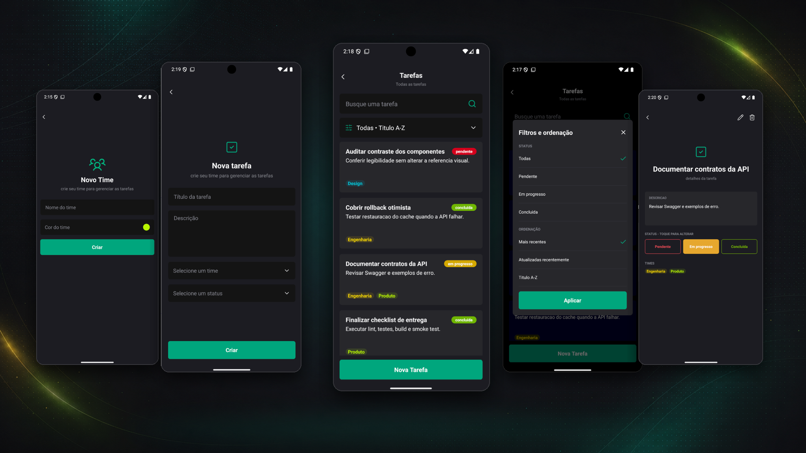
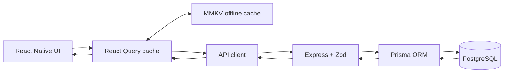
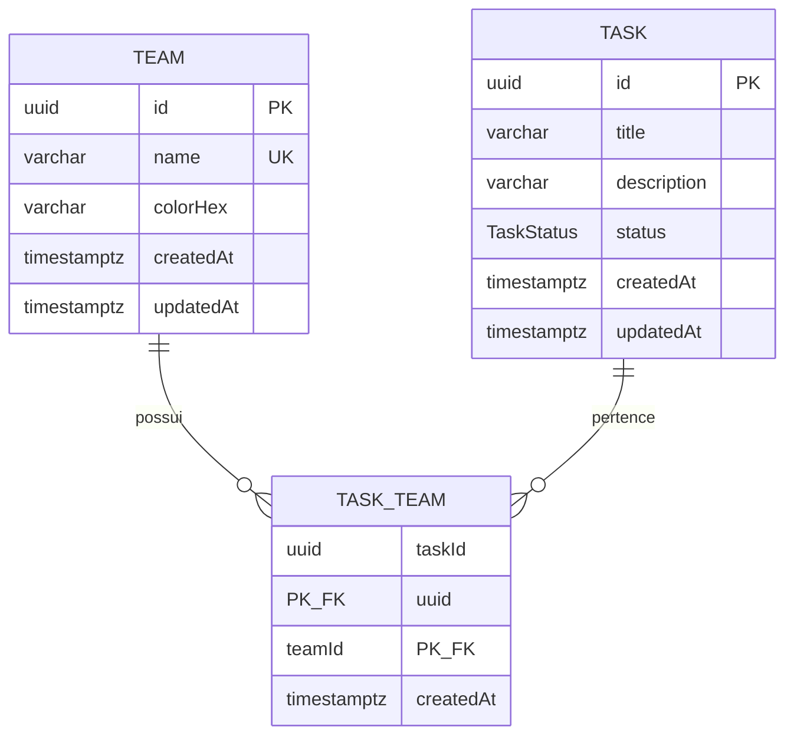
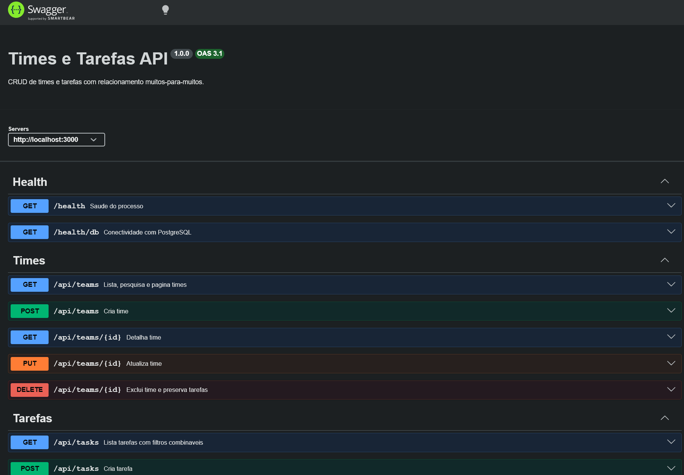

# Gerenciador de Times e Tarefas

Aplicação fullstack para gerenciar times e tarefas. Mobile React Native CLI consome API Express real; API persiste dados em PostgreSQL via Prisma. Inclui CRUDs, relacionamento N:N, busca, filtros combinados, ordenação, paginação, cache offline, optimistic update, migrations, seed, Swagger, testes e automação Windows.



## Funcionalidades

- Times: listar, pesquisar, paginar, detalhar, criar, editar e excluir com confirmação.
- Tarefas: criação, lista global ou por time, detalhe, edição completa,
  exclusão, pesquisa textual, ordenação e paginação.
- Tarefas podem pertencer a zero, um ou vários times.
- Exclusão de time remove somente vínculos; tarefas permanecem.
- Status `PENDING`, `IN_PROGRESS` e `COMPLETED`, com alteração rápida no detalhe.
- Times aparecem como chips coloridos nos cards e no detalhe da tarefa.
- Loading, refresh, página seguinte, vazio, sem resultados, erro/retry e feedback de mutação.
- Cache de queries em MMKV por sete dias; últimos dados ficam visíveis offline.
- Reconexão refaz queries. Mutações offline não fingem sucesso e não são enfileiradas.
- Alteração de status é otimista, com rollback se API falhar.
- Swagger em `/docs` e contrato OpenAPI em `/openapi.json`.

## Stack validada

| Camada         | Tecnologias                                                         |
| -------------- | ------------------------------------------------------------------- |
| Mobile         | React Native CLI 0.86, React 19, TypeScript 5.8, React Navigation 7 |
| Estado remoto  | TanStack React Query 5 + persistência MMKV 4 + NetInfo              |
| Formulários    | React Hook Form 7 + Zod 4                                           |
| UI             | NativeWind 4, Tailwind CSS 3, React Native                          |
| API            | Node.js 24 LTS, Express 5, TypeScript 6, Zod 4                      |
| Dados          | PostgreSQL 18, Prisma 6.19, migrations SQL versionadas              |
| Testes         | Vitest, Supertest, Jest, React Native Testing Library               |
| Ambiente usado | Windows 11, JDK 17, Android API 36, AVD `RN_Pixel_4_API_36`         |

## Arquitetura

```text
RN/
├── api/
│   ├── prisma/                 schema, migrations e seed
│   ├── src/
│   │   ├── config|db|errors|middleware|validation/
│   │   ├── routes/             health, teams e tasks
│   │   └── openapi.ts
│   └── tests/                  unitários e integração PostgreSQL
├── mobile/
│   ├── android|ios/
│   └── src/
│       ├── app|navigation|storage/
│       ├── design-system/
│       ├── features/teams|tasks/
│       ├── screens|services|types|hooks/
├── docs/                       especificação visual e screenshots
├── scripts/                    automação PowerShell/Windows
├── docker-compose.yml
└── package.json                comandos de conveniência
```



### Decisões

- PostgreSQL: integridade referencial, transações, N:N, filtros e ordenação SQL.
- Prisma: schema tipado, migration reproduzível e includes que evitam N+1.
- Express: pequeno, explícito e adequado ao escopo. Validação e erros ficam fora de componentes mobile.
- React Query: API e cache são a única fonte de server state. Estado de busca/filtro continua local.
- MMKV: cache síncrono e rápido no Android. MMKV 4 exige New Architecture/Nitro, habilitada no projeto.
- Sem Redux/Zustand: nenhum estado global adicional foi necessário.
- Sem fila offline de mutação: evita duplicação e conflitos silenciosos. Usuário recebe erro real; queries são refeitas na reconexão.

## Modelo de dados



`TaskTeam` usa chave composta e índices nos dois sentidos. FKs usam `ON DELETE CASCADE` somente no vínculo: excluir time não exclui tarefa; excluir tarefa não exclui time.

## Pré-requisitos Windows

- Windows 10/11 com PowerShell 7 ou Windows PowerShell 5.1.
- Node.js 24 LTS e npm 11.
- Docker Desktop para fluxo recomendado, ou PostgreSQL 18 local.
- JDK 17.
- Android Studio/SDK, Platform 36, Build Tools 36 e AVD.
- `ANDROID_HOME` configurado; `adb` e `emulator` no `PATH`.

Validado neste workspace com Node `24.18.0`, npm `11.16.0`, OpenJDK `17.0.20`, PostgreSQL `18.4` nativo e AVD API 36. Docker não estava instalado no host de validação; Compose foi fornecido para reprodução limpa.

No Windows, prefira um caminho curto, como `C:\dev\times-tarefas-fullstack`.
Dependências nativas do React Native/CMake podem exceder o limite de caminho do
Windows quando o repositório fica aninhado em diretórios longos.

## Variáveis de ambiente

Copie exemplos; nunca versione os arquivos gerados:

```powershell
Copy-Item .env.example .env
Copy-Item api\.env.example api\.env
Copy-Item mobile\.env.example mobile\.env
```

| Arquivo/variável         | Finalidade          | Exemplo seguro                   | Obrigatória               |
| ------------------------ | ------------------- | -------------------------------- | ------------------------- |
| raiz `POSTGRES_DB`       | banco do Compose    | `rn_app`                         | não, possui default       |
| raiz `POSTGRES_USER`     | usuário Compose     | `rn_app_user`                    | não, possui default       |
| raiz `POSTGRES_PASSWORD` | senha local Compose | `rn_app_password`                | não, possui default       |
| raiz `POSTGRES_PORT`     | porta host          | `5433`                           | não                       |
| API `NODE_ENV`           | ambiente            | `development`                    | não                       |
| API `HOST`/`PORT`        | bind HTTP           | `0.0.0.0` / `3000`               | não                       |
| API `PGHOST`/`PGPORT`    | PostgreSQL          | `127.0.0.1` / `5433` com Compose | não                       |
| API `PGDATABASE`         | database            | `rn_app`                         | sim                       |
| API `PGUSER`             | usuário             | `rn_app_user`                    | sim                       |
| API `PGPASSWORD`         | senha               | `rn_app_password`                | sim                       |
| API `PGPOOL_MAX`         | limite do pool      | `10`                             | não                       |
| API `CORS_ORIGIN`        | origem permitida    | `*` somente local                | não                       |
| Mobile `API_BASE_URL`    | host da API         | `http://localhost:3000`          | não, possui default local |

Prisma recebe URL montada internamente a partir de `PG*`; senha não precisa ser duplicada em `DATABASE_URL`.

## Execução local

### 1. Instalação limpa

Na raiz:

```powershell
npm ci
```

`postinstall` executa `npm ci` em `api/` e `mobile/`, usa ambos os lockfiles e gera Prisma Client explicitamente.

### 2. PostgreSQL

Com Docker Desktop, use `PGPORT=5433` no `api\.env`:

```powershell
npm run db:up
docker compose ps
```

Sem Docker, crie banco/usuário equivalentes no PostgreSQL local e ajuste `api\.env`. Teste com `pg_isready -h 127.0.0.1 -p 5432`.

### 3. Migration e seed

```powershell
npm run db:migrate
npm run db:seed
```

Migration leva banco vazio ao schema completo. Seed é idempotente.

### 4. API

Desenvolvimento, em um terminal:

```powershell
npm run dev --prefix api
```

Ou build/start:

```powershell
npm run build --prefix api
npm run start --prefix api
```

Verifique:

```powershell
curl.exe http://localhost:3000/health
curl.exe http://localhost:3000/health/db
Start-Process http://localhost:3000/docs
```

#### Documentação no Swagger (http://localhost:3000/docs)



### 5. Android Emulator

```powershell
npm run android
```

`npm run android` inicia ou reutiliza automaticamente o AVD compacto
`RN_Pixel_4_API_36`, direciona a instalação para ele, inicia Metro quando
necessário e configura `adb reverse` para API e Metro. Sem reverse, use
`http://10.0.2.2:3000` no `mobile\.env` e recompile. Dispositivo físico via
Wi-Fi deve usar IP privado do computador; produção deve usar HTTPS.

Alternativa: `npm run dev` inicia API e Metro juntos; mantenha esse terminal
aberto e execute `npm run android` em outro.

## Scripts

| Comando na raiz                     | Ação                                                             |
| ----------------------------------- | ---------------------------------------------------------------- |
| `npm ci`                            | instala raiz e ambos os projetos                                 |
| `npm run dev`                       | inicia API, aguarda healthcheck e mantém Metro no terminal atual |
| `npm start`                         | inicia API compilada                                             |
| `npm run lint`                      | ESLint API + mobile                                              |
| `npm run format`                    | Prettier API + mobile                                            |
| `npm run format:check`              | valida formatação                                                |
| `npm run typecheck`                 | TypeScript estrito em ambos                                      |
| `npm test`                          | testes API + mobile                                              |
| `npm run test:unit`                 | unitários API                                                    |
| `npm run test:integration`          | integração API/PostgreSQL                                        |
| `npm run test:mobile`               | Jest/RNTL                                                        |
| `npm run build`                     | compila API + APK debug                                          |
| `npm run db:up` / `db:down`         | sobe/desliga PostgreSQL Compose                                  |
| `npm run db:migrate`                | `prisma migrate deploy`                                          |
| `npm run db:seed` ou `npm run seed` | seed idempotente                                                 |
| `npm run android`                   | build, instala e abre app                                        |
| `npm run validate`                  | lint, typecheck, testes, build API e APK debug                   |

## Contratos da API

Todas as listagens retornam `{ data, meta }`, com `total`, `limit`, `offset`, `hasNext`. Recursos unitários retornam `{ data }`. Erros usam:

```json
{
  "error": {
    "code": "VALIDATION_ERROR",
    "message": "Os dados enviados são inválidos.",
    "details": [{ "path": "title", "message": "..." }]
  }
}
```

### Times

- `GET /api/teams?limit=&offset=&search=`
- `GET /api/teams/:id`
- `POST /api/teams`
- `PUT /api/teams/:id`
- `DELETE /api/teams/:id`

### Tarefas

- `GET /api/tasks?teamId=&status=&search=&limit=&offset=&sort=`
- `GET /api/tasks/:id`
- `POST /api/tasks`
- `PUT /api/tasks/:id`
- `PATCH /api/tasks/:id/status`
- `DELETE /api/tasks/:id`

Sort permitido: `createdAt:desc`, `createdAt:asc`, `updatedAt:desc`, `title:asc`, `title:desc`. Limite máximo: 100. Entrada inválida usa HTTP 422; conflito 409; ausente 404; exclusão 204.

## cURLs copiáveis

```powershell
# Criar time
curl.exe -X POST http://localhost:3000/api/teams `
  -H "Content-Type: application/json" `
  -d '{"name":"Operações","colorHex":"#6750A4"}'

# Pesquisar/paginar times
curl.exe "http://localhost:3000/api/teams?search=opera&limit=10&offset=0"

# Criar tarefa sem time
curl.exe -X POST http://localhost:3000/api/tasks `
  -H "Content-Type: application/json" `
  -d '{"title":"Revisar deploy","description":null,"status":"PENDING","teamIds":[]}'

# Criar tarefa com dois times (substitua UUIDs)
curl.exe -X POST http://localhost:3000/api/tasks `
  -H "Content-Type: application/json" `
  -d '{"title":"Revisar fluxo","status":"IN_PROGRESS","teamIds":["11111111-1111-4111-8111-111111111111","22222222-2222-4222-8222-222222222222"]}'

# Filtros combinados
curl.exe "http://localhost:3000/api/tasks?teamId=11111111-1111-4111-8111-111111111111&status=PENDING&search=revisar&sort=updatedAt:desc&limit=7&offset=0"

# Alterar status
curl.exe -X PATCH http://localhost:3000/api/tasks/UUID/status `
  -H "Content-Type: application/json" -d '{"status":"COMPLETED"}'

# Atualizar e excluir
curl.exe -X PUT http://localhost:3000/api/teams/UUID `
  -H "Content-Type: application/json" `
  -d '{"name":"Operações Editado","colorHex":"#6750A4"}'
curl.exe -X DELETE http://localhost:3000/api/tasks/UUID
```

## Seed

`npm run db:seed` faz upsert de 3 times e 40 tarefas fixas. O conjunto inclui
34 tarefas no Design, sendo 30 exclusivas adicionais e distribuídas igualmente
entre os três status. Também cobre tarefa sem time, tarefas com vários times e
descrições pesquisáveis. Depois redefine somente vínculos das tarefas do seed,
portanto repetição não duplica dados.

As listas de tarefas pedem páginas de 7 itens e carregam a próxima página ao se
aproximar do fim. Offsets repetidos, páginas vazias e IDs já exibidos são
ignorados para evitar duplicação ou carregamento em loop.

## Testes e qualidade

```powershell
npm run lint
npm run typecheck
npm run test:unit
npm run test:integration
npm run test:mobile
npm run build
```

- API unit: ambiente, payloads, cores, título, status, filtros, paginação, sort e envelopes.
- API integração: PostgreSQL real, CRUD completo, conflitos, zero/múltiplos times, pesquisa, filtros combinados, metadata, status, update, exclusões e preservação de tarefa.
- Mobile: listas, detalhe, edição completa, chips coloridos, ações de status,
  API client, formulários e transformação de cache otimista.
- CI em `.github/workflows/ci.yml` sobe PostgreSQL e executa migration, seed,
  lint, typecheck, testes e build da API.


## Oportunidades de melhoria:

- autenticação, autorização por time e auditoria;
- rate limiting, CORS restrito, HTTPS e secret manager;
- logs estruturados, métricas, tracing e alertas;
- paginação por cursor para grande volume;
- fila somente para processos assíncronos idempotentes;
- cache compartilhado apenas se métricas justificarem custo/complexidade.

## Limitações verificadas

- iOS não foi compilado no Windows; código React Native e projeto iOS permanecem presentes para build em macOS/Xcode.
- Deploy/publicação externa ficaram fora dessa avaliação.
